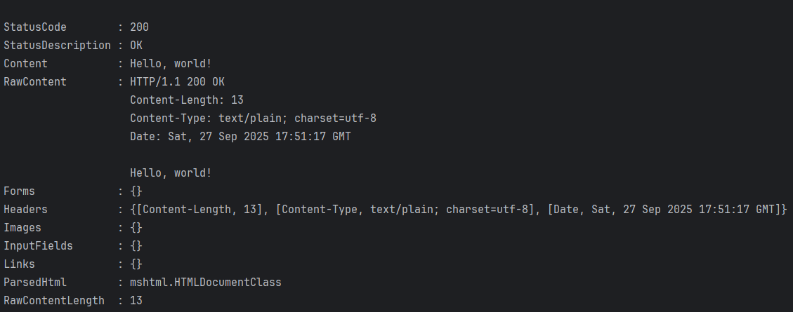
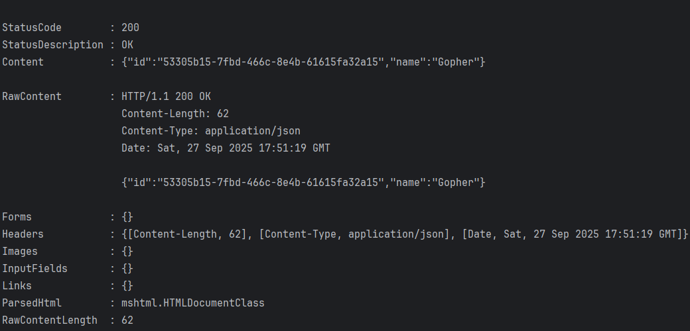
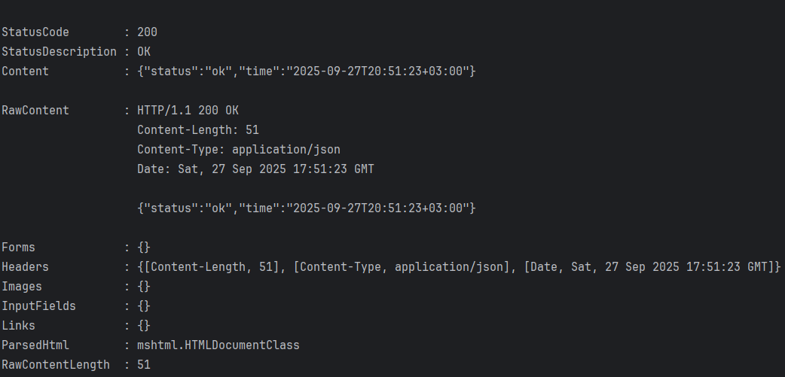
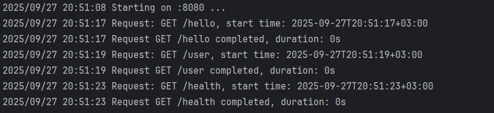

# Практическая работа № 1
## Автор
Курков Владислав Николаевич
ПИМО-01-25

## Задание
- Установить Go и Git, проверить версии.
- Инициализировать модуль Go в новом проекте.
- Реализовать HTTP-сервер с маршрутами /hello (текст) и /user (JSON).
- Подключить внешнюю библиотеку (генерация UUID) и использовать её в /user.
- Запустить и проверить ответы curl/браузером.
- Собрать бинарник .exe и подготовить README и отчёт.


##	Структура проекта
```
pr1/
├── assets/                # Папка с изображениями
├── cmd/
│   └── server/      
│       └── main.go        # Точка входа для запуска сервера
│
├── internal/              # Внутренние пакеты для основной логики
│   ├── handlers/          # Обработчики для различных HTTP-эндпоинтов
│   └── middlewares/       # Пользовательские middleware-слои
│
├── go.mod                 # Конфигурационный файл модуля Go
├── go.sum                 # Файл чексума зависимостей
```

## Руководство по запуску API

### Установка пакетов
```bash
go mod tidy
```

### Разработка
Для запуска в режиме отладки:
```bash
go run ./cmd/server/main.go
```

### Сборка релиза
Создание исполняемого файла:
```bash
go build -o helloapi.exe ./cmd/server
```

Запуск собранного приложения:
```bash
.\helloapi
```

## Тестирование эндпоинтов

```bash
curl http://localhost:8080/hello
```

```bash
curl http://localhost:8080/user
```

```bash
curl http://localhost:8080/health
```

## Настройки
Параметры конфигурации:
 - APP_PORT - номер порта для сервера (опционально, значение по умолчанию: 8080)

## Демонстрация интерфейса
### Ответ от /hello

### Ответ от /user  

### Ответ от /health

### Журнал работы сервера


---