# Практическая работа № 10

## Автор
Курков Владислав Николаевич
ПИМО-01-25

## Задание
JWT-аутентификация: создание и проверка токенов. Middleware для авторизации.

**Цели:**
- Реализовать полноценную аутентификацию и авторизацию пользователей с помощью JWT (access/refresh токены).
- Научиться разграничивать права по ролям (admin/user).
- Создать защищённые эндпоинты для профиля и админ-статистики.
- Освоить работу с middleware для проверки подлинности токена (authn) и проверки прав (authz).

**Что сделано:**
- Регистрация и логин пользователей с выдачей access/refresh JWT-токенов.
- Хранение пользователей в памяти (user_mem.go), поддержка ролей (admin/user).
- Middleware для проверки подлинности токена (authn) и проверки прав (authz).
- Эндпоинты для получения профиля, обновления токенов, просмотра пользователей, админ-статистики.
- Вся логика JWT вынесена в отдельный пакет, поддерживается настройка TTL и секретов через переменные окружения.

## Подготовка к запуску

### Структура проекта
```
Prak_10/
├── assets/
├── cmd/
│   └── server/
│       └── main.go
├── internal/
│   ├── core/
│   │   ├── service.go
│   │   └── user.go
│   ├── http/
│   │   ├── router.go
│   │   └── middleware/
│   │       ├── authn.go
│   │       └── authz.go
│   ├── platform/
│   │   ├── config/
│   │   │   └── config.go
│   │   └── jwt/
│   │       └── jwt.go
│   └── repo/
│       └── user_mem.go
├── go.mod
└── README.md
```

### Команда запуска
```bash
go run ./cmd/server
```

## Примеры запросов

### HAPPY-PATH: ADMIN

#### 1. Логин admin
```bash
curl -Method POST http://localhost:8080/api/v1/login `
  -Headers @{"Content-Type"="application/json"} `
  -Body '{"email":"admin@example.com","password":"secret123"}'
```
Результат:

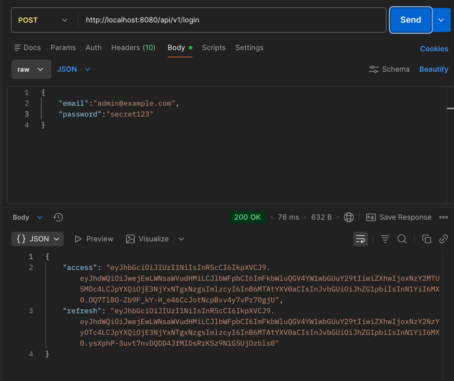

#### 2. Получить свой профиль /me
```bash
curl -Method GET http://localhost:8080/api/v1/me `
  -Headers @{"Authorization"="Bearer $ADMIN_TOKEN"}
```
Результат:

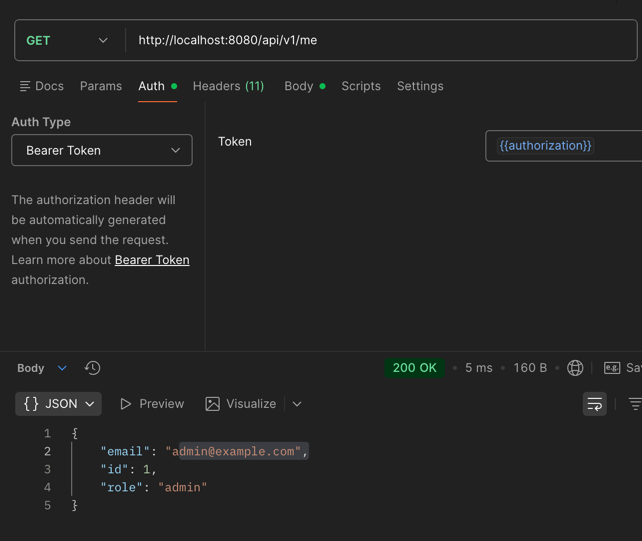

#### 3. Доступ к /admin/stats
```bash
curl -Method GET http://localhost:8080/api/v1/admin/stats `
  -Headers @{"Authorization"="Bearer $ADMIN_TOKEN"}
```
Результат:

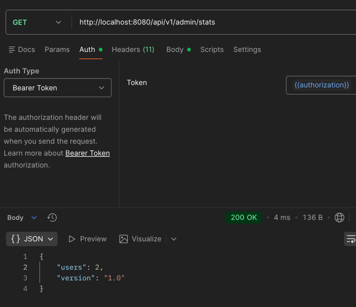

#### 4. Admin может смотреть любого юзера /users/{id}
```bash
curl -Method GET http://localhost:8080/api/v1/users/1 `
  -Headers @{"Authorization"="Bearer $ADMIN_TOKEN"}
```
Результат:

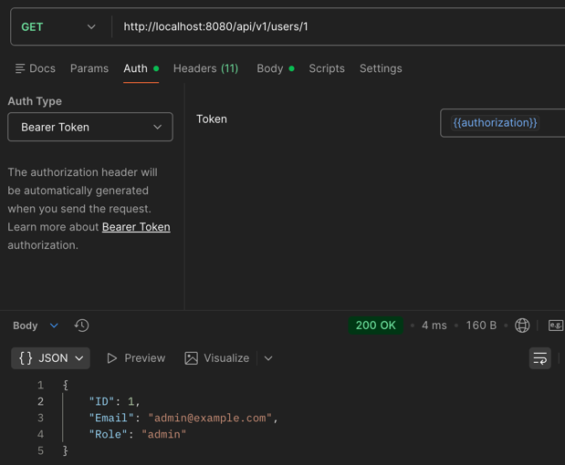

#### 5. Admin может обновлять токены (refresh)
```bash
curl -Method POST http://localhost:8080/api/v1/refresh `
  -Headers @{"Content-Type"="application/json"} `
  -Body "{`"Refresh`": `"$ADMIN_REFRESH`"}"
```
Результат:

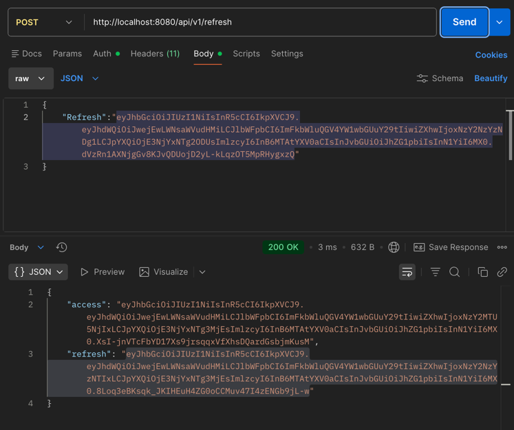

---

### HAPPY-PATH: USER

#### 1. Логин user
```bash
curl -Method POST http://localhost:8080/api/v1/login `
  -Headers @{"Content-Type"="application/json"} `
  -Body '{"email":"user@example.com","password":"secret123"}'
```
Результат:

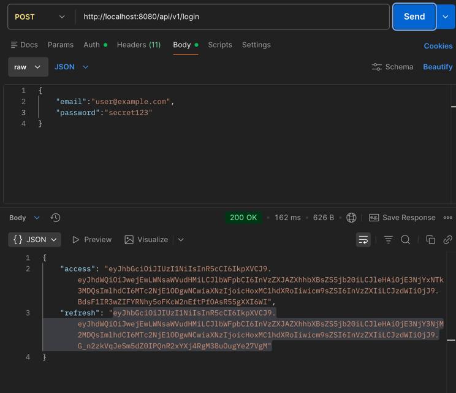

#### 2. User получает свой профиль /me
```bash
curl -Method GET http://localhost:8080/api/v1/me `
  -Headers @{"Authorization"="Bearer $USER_TOKEN"}
```
Результат:

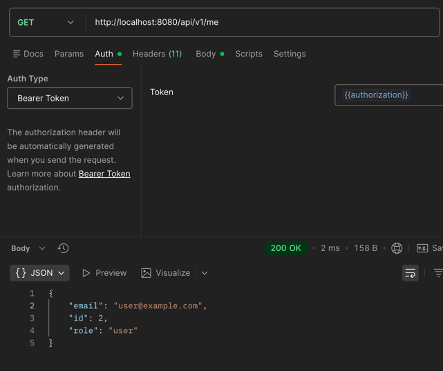

#### 3. User может посмотреть ТОЛЬКО себя /users/{id}
```bash
curl -Method GET http://localhost:8080/api/v1/users/2 `
  -Headers @{"Authorization"="Bearer $USER_TOKEN"}
```
Результат:

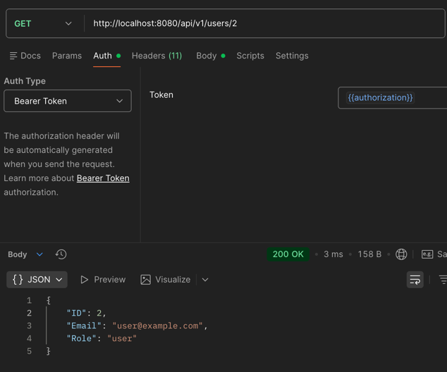

#### 4. User может обновить токены (refresh)
```bash
$userRefreshResponse = curl -Method POST http://localhost:8080/api/v1/refresh `
  -Headers @{"Content-Type"="application/json"} `
  -Body "{`"Refresh`": `"$USER_REFRESH`"}"
$userRefreshResponse.Content
```
Результат:

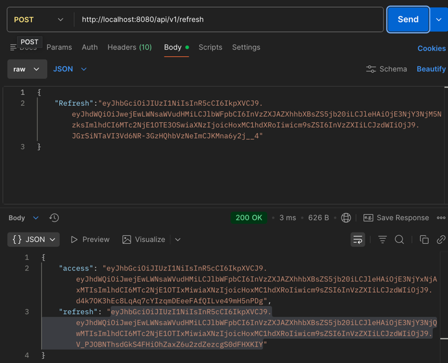

---

### НЕ HAPPY-PATH — проверка ошибок

#### 1. User НЕ может зайти в /admin/stats
```bash
curl -Method GET http://localhost:8080/api/v1/admin/stats `
  -Headers @{"Authorization"="Bearer $USER_TOKEN"}
```
*Ожидаем: 403 Forbidden*

Результат:

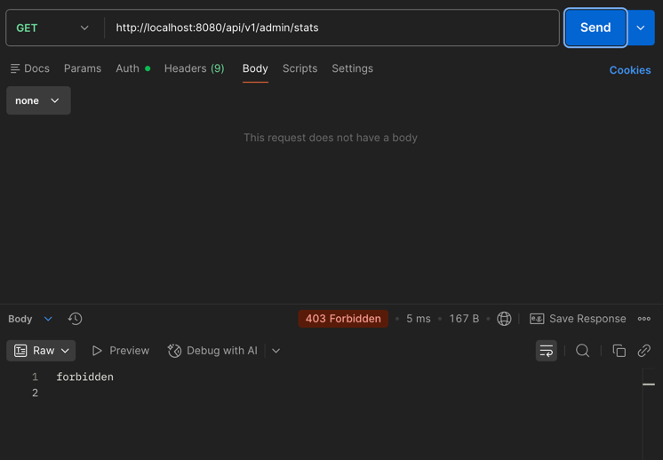

#### 2. User НЕ может получить /users/1 (админа)
```bash
curl -Method GET http://localhost:8080/api/v1/users/1 `
  -Headers @{"Authorization"="Bearer $USER_TOKEN"}
```
*Ожидаем: 403 Forbidden*

Результат:

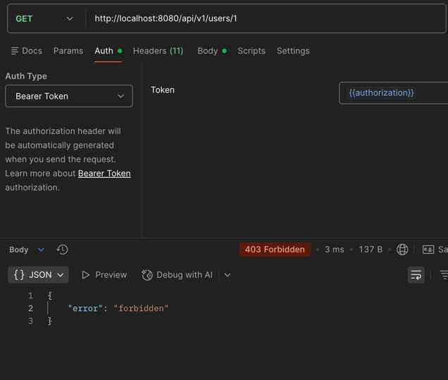

## Контрольные вопросы

### 1. Что такое клеймы JWT и чем отличаются registered, public, private? Почему важно `exp`?

**Клеймы (claims)** — это утверждения (набор данных) внутри JWT, которые описывают пользователя и контекст токена.

**Виды клеймов:**
- **Registered claims** — стандартные клеймы, описанные в RFC 7519:
    - `iss` — издатель токена
    - `sub` — субъект (пользователь)
    - `aud` — аудитория
    - `exp` — время истечения
    - `iat` — время выпуска
    - `nbf` — не действителен до
- **Public claims** — пользовательские клеймы, зарегистрированные в публичном реестре или оформленные как URI, чтобы избежать конфликтов имён.
- **Private claims** — произвольные клеймы, используемые по договорённости между сервисами (например, `role`, `user_id`).

**Почему важен `exp`:**
- Ограничивает время жизни токена.
- Снижает риск компрометации (украденный токен нельзя использовать вечно).
- Является обязательным для безопасной stateless-аутентификации.

Без `exp` токен может быть использован неограниченно долго, что является серьёзной уязвимостью.

---

### 2. Чем stateless-аутентификация на JWT отличается от сессионных cookie на сервере? Плюсы и минусы

**JWT (stateless):**
*Как работает:*
- Сервер выдаёт токен.
- Сервер не хранит состояние сессии.
- Вся информация находится внутри JWT.

*Плюсы:*
- Хорошо масштабируется (не нужен общий session store).
- Удобно для микросервисов.
- Нет зависимости от хранилища сессий.

*Минусы:*
- Сложно отзывать токены до `exp`.
- JWT больше по размеру.
- Ошибки в клеймах = уязвимости.

**Сессионные cookie (stateful):**
*Как работает:*
- Сервер хранит сессию.
- Клиент передаёт только идентификатор сессии.

*Плюсы:*
- Простая логика отзыва сессии.
- Меньше данных на клиенте.
- Проще реализовать сложные политики безопасности.

*Минусы:*
- Требуется хранилище сессий (Redis, БД).
- Сложнее масштабировать.
- Нужно решать sticky sessions или shared storage.

---

### 3. Как устроена цепочка middleware и почему AuthZ должна идти после AuthN?

**Middleware** — это цепочка обработчиков, где каждый:
- получает запрос;
- может его обработать или прервать;
- передаёт управление дальше.

**Типичная цепочка:**
1. Logging
2. Recovery
3. Authentication (AuthN)
4. Authorization (AuthZ)
5. Business logic

**Почему AuthZ после AuthN:**
- **AuthN** отвечает на вопрос: *кто ты?*
- **AuthZ** отвечает на вопрос: *что тебе можно?*

Без успешной аутентификации невозможно корректно проверить права доступа. AuthZ без AuthN не имеет смысла, так как нет субъекта для проверки.

---

### 4. RBAC vs ABAC: когда что выбирать? Примеры

**RBAC (Role-Based Access Control):**
Доступ определяется **ролью пользователя**.

*Пример:*
- `admin` — полный доступ
- `manager` — редактирование
- `user` — просмотр

*Когда использовать:*
- Простая иерархия прав.
- Небольшое количество ролей.
- Админ-панели, корпоративные системы.

*Минусы:*
- Плохо масштабируется при большом количестве условий.
- Роли разрастаются.

**ABAC (Attribute-Based Access Control):**
Доступ определяется **атрибутами** пользователя, ресурса и контекста.

*Пример:*
Пользователь может редактировать документ, если:
- он владелец;
- документ в статусе `draft`;
- время запроса — рабочее.

*Когда использовать:*
- Сложные бизнес-правила.
- Много условий доступа.
- Финансовые, облачные и enterprise-системы.

*Минусы:*
- Сложнее реализовать и тестировать.

---

### 5. Как безопасно хранить пароль и почему нужен bcrypt/argon2 вместо SHA-256? (соль/pepper)

**Неправильный подход:**
Использование простых хеш-функций (например, SHA-256) без соли уязвимо для радужных таблиц и атак перебором, так как они спроектированы быть быстрыми.

**Правильный подход (bcrypt/argon2):**
- **bcrypt** и **Argon2** — это функции, специально разработанные для хеширования паролей.
- Они являются **адаптивными** (можно увеличить стоимость вычислений) и **медленными** по замыслу, что затрудняет атаки перебором.

**Соль (salt):**
- Уникальная случайная строка, добавляемая к каждому паролю перед хешированием.
- Одинаковые пароли у разных пользователей получают разные хеши.
- Делает радужные таблицы бесполезными.

**Перец (pepper):**
- Секретное значение, общее для всех паролей, хранящееся отдельно от базы данных (например, в коде приложения или переменных окружения).
- Добавляет дополнительный уровень защиты на случай компрометации базы данных.

## Выводы
В ходе практической работы был реализован полноценный механизм JWT-аутентификации и авторизации на основе ролей (RBAC) для HTTP API на Go. Удалось настроить выпуск и обновление пары токенов (access/refresh), а также создать middleware для проверки подлинности и прав доступа.

Практика показала важность разделения логики аутентификации (AuthN) и авторизации (AuthZ), а также правильного порядка их выполнения в цепочке обработчиков. Реализация защиты эндпоинтов `/admin/stats` и `/users/{id}` наглядно продемонстрировала, как гибко можно разграничивать доступ на основе роли и контекста запроса. Полученные навыки являются основой для построения безопасных и масштабируемых веб-приложений.