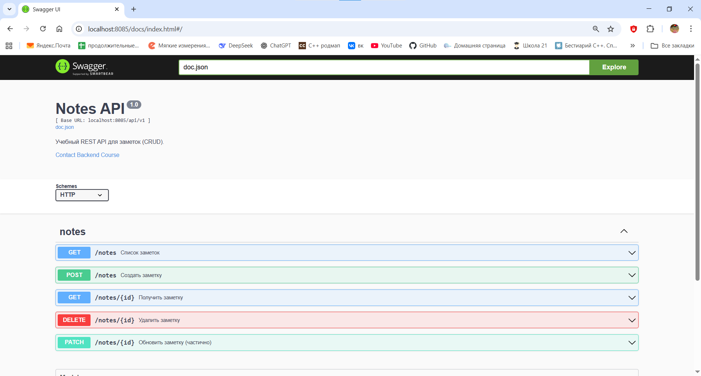
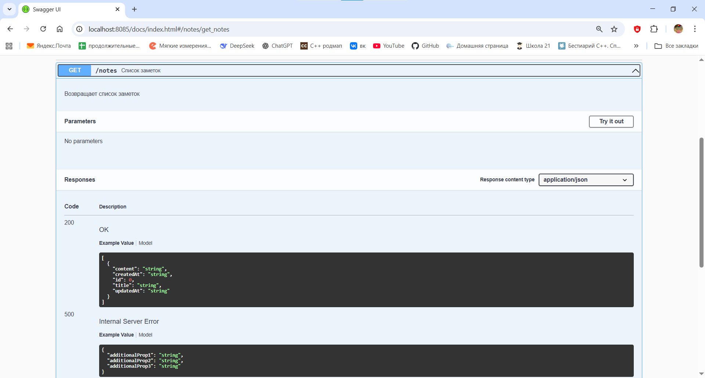

# Практическая работа № 12

## Автор
Курков Владислав Николаевич
ПИМО-01-25

## Задание
Подключение Swagger/OpenAPI. Автоматическая генерация документации.

**Цели:**
1.  Освоить основы спецификации OpenAPI (Swagger) для REST API.
2.  Подключить автогенерацию документации к проекту из ПЗ 11 (notes-api).
3.  Научиться публиковать интерактивную документацию (Swagger UI / ReDoc) на эндпоинте GET /docs.
4.  Синхронизировать код и спецификацию (комментарии-аннотации → генерация).
5.  Подготовить процесс обновления документации (Makefile/скрипт).

**Используемый подход:** Code-first — бизнес-логика и HTTP-обработчики реализуются в Go, поверх них добавляются Swagger-аннотации, из которых автоматически генерируется спецификация OpenAPI.

## Подготовка к запуску

### Структура проекта
```
notes-api/
├── cmd/
│   └── api/
│       └── main.go
├── internal/
│   ├── core/
│   │   └── note.go
│   ├── http/
│   │   ├── router.go
│   │   └── handlers/
│   │       └── notes.go
│   └── repo/
│       └── note_mem.go
├── docs/
│   ├── docs.go
│   ├── swagger.json
│   └── swagger.yaml
├── api/
│   └── openapi.yaml
└── go.mod
```

### Установка зависимостей

Для генерации документации используется утилита `swag`:

```bash
go install github.com/swaggo/swag/cmd/swag@latest
```

### Команда для генерации документации
```bash
swag init -g cmd/api/main.go -o docs
```

После выполнения в каталоге `docs/` создаются:
- `swagger.json` и `swagger.yaml` — спецификация OpenAPI;
- `docs.go` — пакет для встраивания Swagger UI в сервер.

## Примеры Swagger-аннотаций

Аннотации размещаются непосредственно над HTTP-обработчиками.

### Создание заметки (POST /notes)
```go
// CreateNote godoc
// @Summary      Создать заметку
// @Tags         notes
// @Accept       json
// @Produce      json
// @Param        input  body     NoteCreate  true  "Данные новой заметки"
// @Success      201    {object} core.Note
// @Failure      400    {object} map[string]string
// @Failure      500    {object} map[string]string
// @Router       /notes [post]
func (h *Handler) CreateNote(w http.ResponseWriter, r *http.Request) {
    // ...
}
```

### Получение списка заметок (GET /notes)
```go
// ListNotes godoc
// @Summary      Список заметок
// @Tags         notes
// @Success      200  {array} core.Note
// @Router       /notes [get]
func (h *Handler) ListNotes(w http.ResponseWriter, r *http.Request) {
    // ...
}
```

## Документация API

После запуска сервера интерактивная документация доступна по адресу:
```
http://localhost:8080/docs/
```

### Главная страница Swagger UI


### Документация по эндпоинтам заметок


## Выводы
В ходе практической работы была подключена автоматическая генерация документации Swagger/OpenAPI к существующему REST API (проект notes-api). Освоен подход code-first с использованием аннотаций в Go-коде и инструмента `swag`. Документация публикуется в виде интерактивного интерфейса Swagger UI и синхронизирована с кодом приложения, что упрощает сопровождение, тестирование и дальнейшее развитие API.