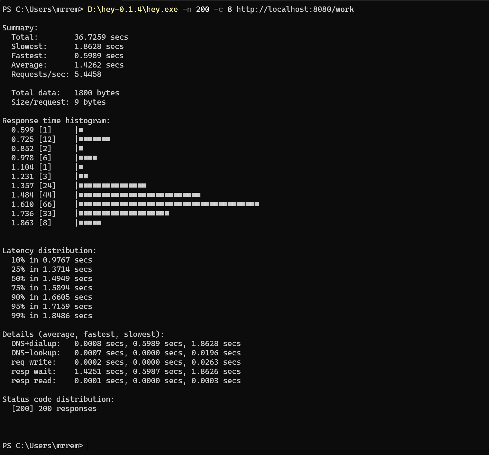
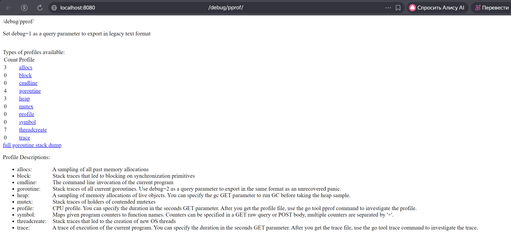
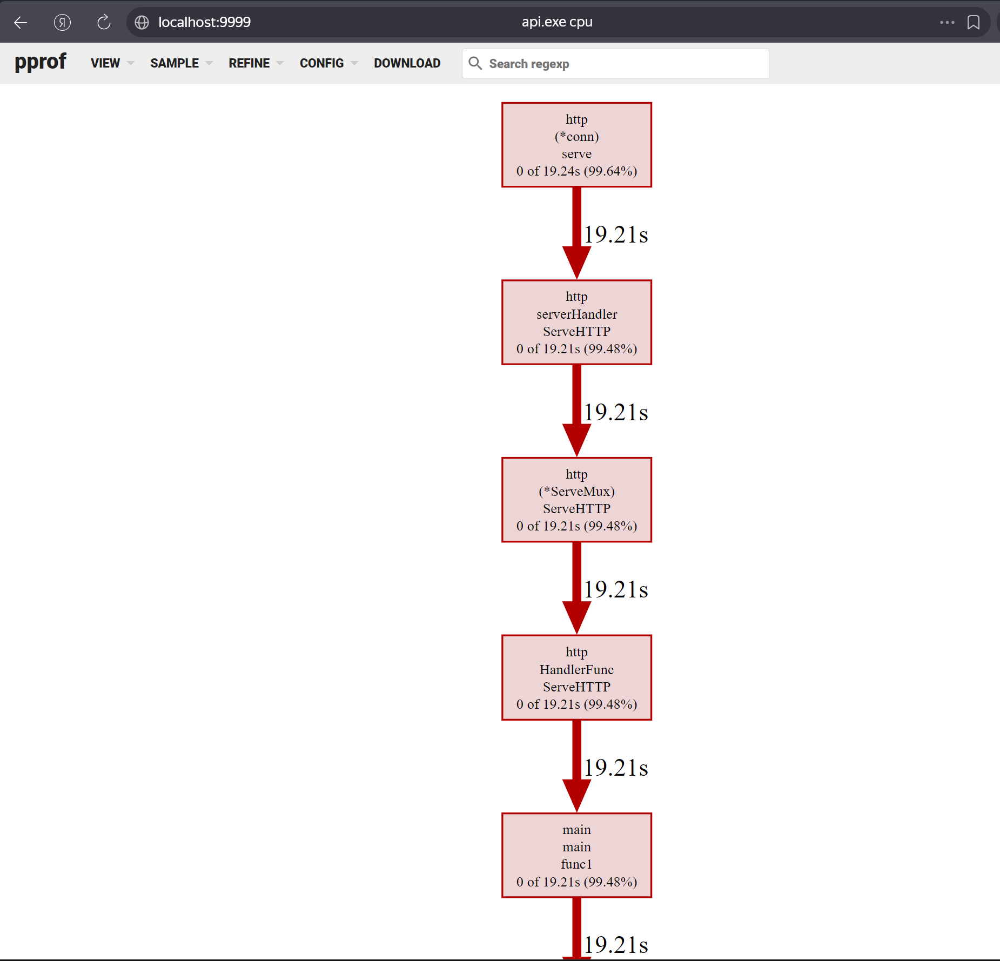
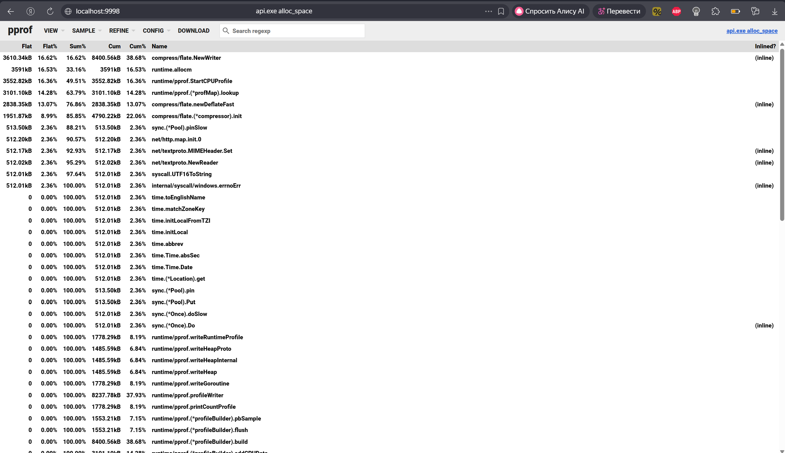
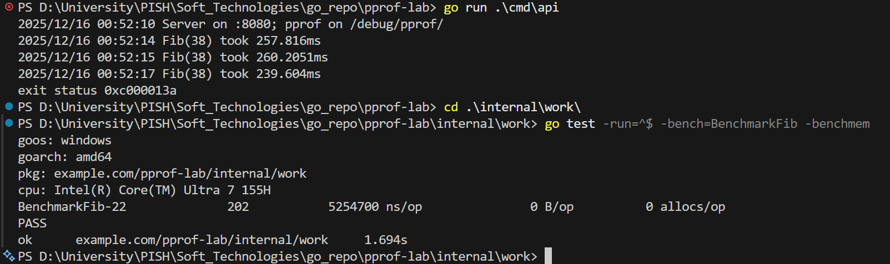
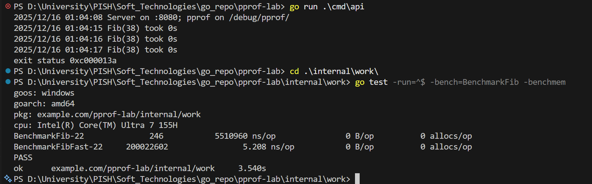

# Практическая работа № 13

## Автор
Курков Владислав Николаевич
ПИМО-01-25

## Задание
Профилирование Go-приложения (pprof). Измерение времени работы функций.

**Цели:**
1. Научиться подключать и использовать профилировщик `pprof` для анализа CPU, памяти, блокировок и горутин.
2. Освоить базовые техники измерения времени выполнения функций (ручные таймеры, бенчмарки).
3. Научиться читать отчёты `go tool pprof`, строить графы вызовов и находить "узкие места".
4. Сформировать практические навыки оптимизации кода на основании метрик.

## Подготовка к запуску

### Структура проекта
```
pprof-lab/
├── assets/
├── cmd/
│   └── api/
│       └── main.go
├── internal/
│   └── work/
│       ├── slow.go
│       ├── slow_test.go
│       └── timer.go
├── go.mod
└── README.md
```

### Инициализация и установка зависимостей
```bash
cd pprof-lab
go mod init example.com/pprof-lab
```

### Запуск приложения
```bash
go run ./cmd/api
```

## Профилирование и анализ производительности

### Анализ нагрузки с помощью утилиты hey
Для нагрузочного тестирования использовалась утилита `hey`:



### Индекс pprof
После запуска приложения профилировщик pprof доступен по адресу:
```
http://localhost:8080/debug/pprof/
```



### CPU-профиль

**Анализ top (наиболее ресурсоёмкие функции):**


**Граф вызовов (web):**


### HEAP-профиль (анализ аллокаций памяти)

**inuse_space** — память, используемая в данный момент:


**alloc_space** — суммарно выделенная память за всё время:


> На HEAP-профиле видно, что основное количество аллокаций связано с рекурсивными вызовами функции `Fib`, а также с внутренними структурами pprof и стандартной библиотеки. После оптимизации аллокации практически отсутствуют.

## Бенчмарки

### Запуск бенчмарков
```bash
cd ./cmd/api
go test -run=^$ -bench=BenchmarkFib -benchmem
```

**До оптимизации:**


**После оптимизации:**


## Оптимизация кода

### Выявленная проблема
В исходной версии использовалась рекурсивная реализация функции `Fib`, что приводило к экспоненциальному времени работы и огромному количеству вызовов.

### Внесённые изменения
Для оптимизации была добавлена функция `FibFast`, использующая итеративный подход, что позволило сократить время выполнения с миллисекунд до наносекунд.

### Сравнительная таблица метрик до/после

| Версия         | ns/op      | B/op | allocs/op |
|----------------|------------|------|-----------|
| Fib (до)       | 5,510,960  | 0    | 0         |
| FibFast (после)| 5.2        | 0    | 0         |

## Контрольные вопросы

*(В оригинальном README вопросы отсутствовали. Если вы пришлете список вопросов, я с удовольствием дополню этот раздел. А пока я оставлю заголовок для них.)*

1. ...
2. ...
3. ...

## Выводы
В ходе практической работы были освоены инструменты профилирования Go-приложений с помощью `pprof`. Удалось подключить профилировщик к приложению, провести анализ CPU и памяти, а также интерпретировать полученные графики и отчёты.

С помощью бенчмарков и ручных таймеров было выявлено "узкое место" — рекурсивная реализация функции вычисления чисел Фибоначчи. Оптимизация алгоритма до итеративного подхода позволила добиться колоссального прироста производительности (с ~5.5 млн наносекунд до ~5 наносекунд на операцию), что подтверждает эффективность использования профилирования для целенаправленной оптимизации кода.