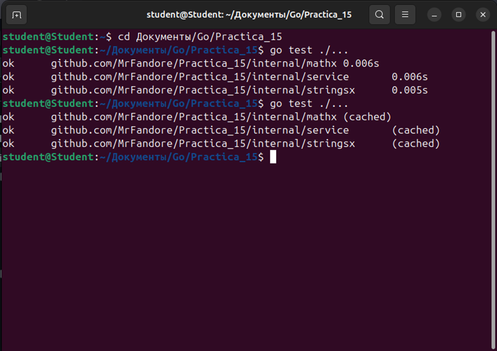
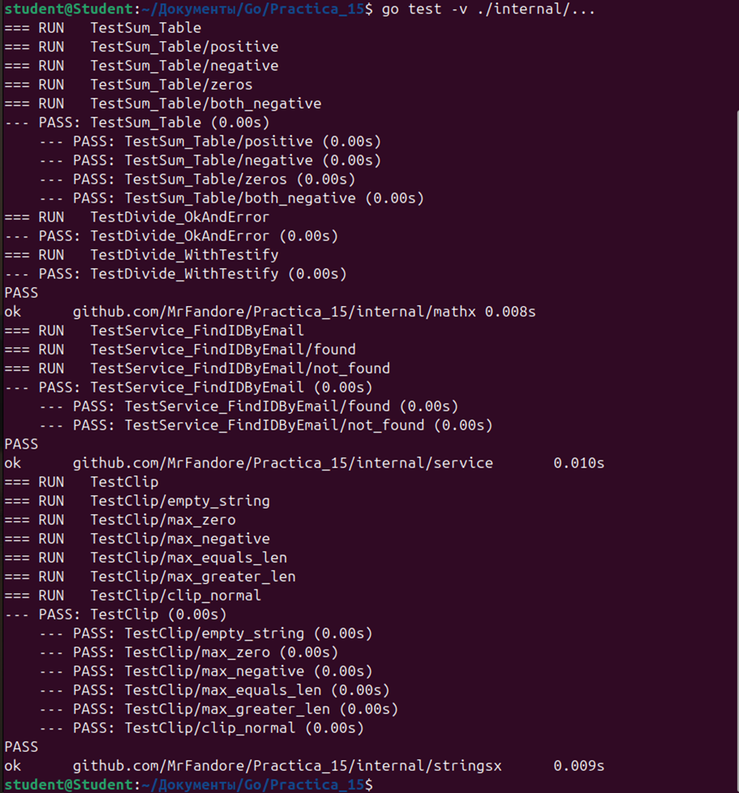
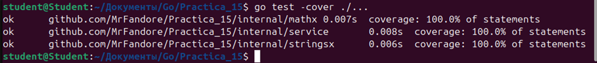
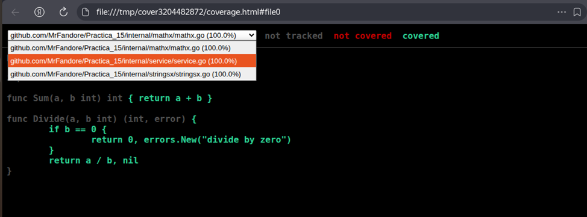

# Практическая работа № 15

## Автор
Курков Владислав Николаевич
ПИМО-01-25

## Задание
Unit-тестирование функций (testing, testify).

**Цели:**
* Освоить базовые приёмы unit-тестирования в Go с помощью стандартного пакета `testing`.
* Научиться писать табличные тесты, подзадачи `t.Run`, тестировать ошибки и паники.
* Освоить библиотеку утверждений `testify` (`assert`, `require`) для лаконичных проверок.
* Научиться измерять покрытие кода (`go test -cover`) и формировать html-отчёт покрытия.
* Подготовить минимальную структуру проектных тестов и общий чек-лист качества тестов.

## Подготовка к запуску

### Клонирование репозитория
```bash
git clone https://github.com/MrFandore/Goland.git
cd Goland/Practica_15
```

### Структура проекта
```
pz15-tests/
├── internal/
│   ├── mathx/
│   │   ├── mathx.go
│   │   └── mathx_test.go
│   ├── stringsx/
│   │   ├── stringsx.go
│   │   └── stringsx_test.go
│   └── service/
│       ├── repo.go
│       ├── service.go
│       └── service_test.go
├── go.mod
└── go.sum
```

## Запуск тестов и анализ покрытия

### Базовый запуск тестов
```bash
go test ./...
```
Результат:



### Запуск с подробным выводом (verbose)
```bash
go test -v ./internal/...
```
Результат:



### Проверка покрытия кода
```bash
go test -cover ./...
```
Результат:



### Генерация HTML-отчета о покрытии
```bash
# Сохранение профиля покрытия
go test -coverprofile=coverage.out ./...

# Генерация HTML-отчета
go tool cover -html=coverage.out
```
Результат:



## Примеры тестов

### Табличный тест (mathx)
```go
func TestAdd(t *testing.T) {
    tests := []struct {
        name     string
        a, b     int
        expected int
    }{
        {"positive numbers", 2, 3, 5},
        {"negative numbers", -1, -2, -3},
        {"zero values", 0, 5, 5},
    }

    for _, tt := range tests {
        t.Run(tt.name, func(t *testing.T) {
            result := Add(tt.a, tt.b)
            assert.Equal(t, tt.expected, result)
        })
    }
}
```

### Тестирование ошибок (service)
```go
func TestGetUser_NotFound(t *testing.T) {
    repo := NewMockRepo()
    service := NewService(repo)

    user, err := service.GetUser(999)
    
    assert.Error(t, err)
    assert.Nil(t, user)
    assert.EqualError(t, err, "user not found")
}
```

### Тестирование паники (stringsx)
```go
func TestPanicOnEmpty(t *testing.T) {
    assert.Panics(t, func() {
        StringsX.Process("")
    }, "Функция должна паниковать при пустой строке")
}
```

## Выводы
В ходе практической работы были освоены основные подходы к unit-тестированию в Go:

1. **Табличные тесты** позволяют компактно и наглядно описывать множество тестовых случаев для одной функции, что упрощает поддержку и расширение тестов.

2. **Подзадачи `t.Run`** дают возможность группировать тесты и запускать их независимо, а также получать более структурированный вывод результатов.

3. **Библиотека `testify`** значительно сокращает объем кода для проверок и делает тесты более читаемыми за счет декларативных утверждений `assert` и `require`.

4. **Анализ покрытия кода** с помощью `go test -cover` и генерация HTML-отчета позволяют визуально оценить, какие части кода остались непротестированными, и целенаправленно улучшать покрытие.

Полученные навыки являются основой для написания качественных и надежных тестов в реальных проектах, что критически важно для поддержания стабильности кодовой базы при внесении изменений.

---
