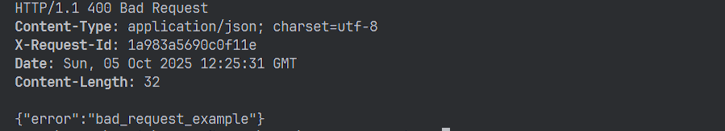
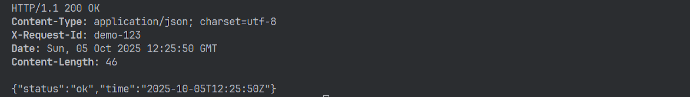

# Практическая работа № 2 
## Автор
Курков Владислав Николаевич
ПИМО-01-25

## Задание
#### Цели:
- Понять назначение ключевых директорий (cmd/, internal/, pkg/ и др.).
- Научиться раскладывать код и артефакты проекта по «правильным» местам

#### Условия:
- Структура проекта: есть cmd/, internal/, utils/; main минимален.
- Работающие ручки: / (текст) и /ping (JSON).
- Логирование: выводится метод/путь/адрес; (доп.) X-Request-Id.
- Код-стиль: форматирование, имена пакетов, аккуратные импорты.
- Git/README: есть первый коммит и краткий README (что это и как запустить).
- Единый формат ошибок (utils.WriteErr), маршрут /fail.
- Вынос /ping в отдельный пакет handlers и подключение.


##	Структура проекта

```
pr2/
├── assets/                 # Папка с изображениями
├── cmd/
│   └── myapp/
│       └── main.go         # Точка входа приложения
├── internal/
│   ├── app/
│   │   ├── app.go          # Инициализация приложения, маршрутизация
│   │   └── handlers/
│   │       ├── fail.go     # Обработчик для тестирования ошибок
│   │       ├── ping.go     # Обработчик для проверки работоспособности (ping)
│   │       └── root.go     # Корневой обработчик
│   └── utils/
│       ├── httpjson.go     # Утилиты для работы с JSON в HTTP
│       └── logger.go       # Логгер
```


### Установка
Установка зависимостей
```bash
go mod tidy
```

### Отладка
Запуск проекта в режиме разработки
```bash
go run ./cmd/myapp/main.go
```

### Билд
Билд проекта
```bash
go build -o myapp.exe ./cmd/myapp
```
Запуск билда
```bash
.\myapp
```

## Примеры запросов

```bash
curl http://localhost:8080/
```

```bash
curl http://localhost:8080/ping
```

```bash
curl http://localhost:8080/fail
```
Также у каждому запросу можно вручную прописать X-Request-Id, иначе он сгенерируется автоматически
```bash
curl -i -H "X-Request-Id: demo-123" http://localhost:8080/ping
```

## Конфигурация
Переменные окружения:
- APP_PORT - порт, на котором работает сервер (необязательно, по-умолчанию 8080)

## Скриншоты работы

### Результат запроса /fail


### Результат запроса /ping

