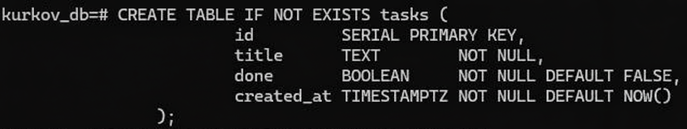
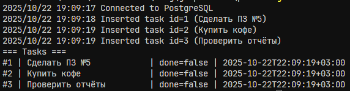
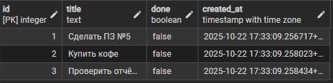

# Практическая работа № 5

## Автор
Курков Владислав Николаевич
ПИМО-01-25


## Задание

Подключение к PostgreSQL через database/sql. Выполнение простых запросов (INSERT, SELECT)

Цели:
- Установить и настроить PostgreSQL.
- Подключиться к БД из Go с помощью database/sql и драйвера PostgreSQL.
- Выполнить параметризованные запросы INSERT и SELECT.
- Корректно работать с context, пулом соединений и обработкой ошибок

## Окружение
- Сервер: go 1.23.0
- БД: PostgreSQL 16.10 

## Результаты выполнения
#### Создание таблицы tasks



#### Выполнение команды
```bash
go run .
```



#### Вывод содержимого таблицы tasks
```bash
SELECT * FROM tasks;
```


## Ответы на вопросы

1. __Пул соединений sql.DB и зачем его настраивать:__
sql.DB представляет собой пул соединений, который управляет набором подключений к БД для многопоточной работы. Настройка параметров вроде SetMaxOpenConns, SetMaxIdleConns и SetConnMaxLifetime ограничивает нагрузку на сервер, минимизирует задержки и предотвращает утечки ресурсов.

2. __Почему используем плейсхолдеры $1, $2:__
Они используются для безопасной параметризации запросов, блокируя SQL-инъекции путем автоматического экранирования значений и разделения кода от данных.

3. __Чем отличаются Query, QueryRow и Exec:__
Exec подходит для операций без возврата строк (INSERT/UPDATE/DELETE), возвращая только статус выполнения. QueryRow ожидает одну строку результата (для SELECT одного объекта). Query предназначен для множественных строк (SELECT списка).


## Обоснование транзакций и пула
Транзакции применяются для атомарных операций вроде массовой вставки: при ошибке откатывает все изменения, обеспечивая консистентность данных без частичных обновлений.

Настройки пула (SetMaxOpenConns=10, SetMaxIdleConns=5, SetConnMaxLifetime=30min) оптимизированы для учебного проекта на локальной машине — балансируют производительность и ресурсы, избегая перегрузки PostgreSQL при параллельных запросах.(see the generated image above)(see the generated image above)

## Подготовка к запуску
Установка зависимостей
```bash
go mod tidy
```

### Отладка
Запуск проекта в режиме разработки
```bash
make run
```

### Билд
Билд проекта
```bash
make build
```
Запуск билда
```bash
.\pz5-db
```

## Конфигурация
Переменные окружения:
- DATABASE_URL - строка подключения к базе данных 

## Выводы
## Выводы

Практическая работа позволила освоить подключение Go-приложения к PostgreSQL через стандартный пакет database/sql с использованием параметризованных запросов INSERT и SELECT.

Реализована полная схема работы с базой данных: от создания таблицы tasks и настройки пула соединений до выполнения транзакций и обработки ошибок с учетом контекста. Полученные навыки настройки *sql.DB (ограничение соединений, lifetime) и использование плейсхолдеров обеспечивают безопасную и производительную работу с БД в учебных и реальных проектах.
